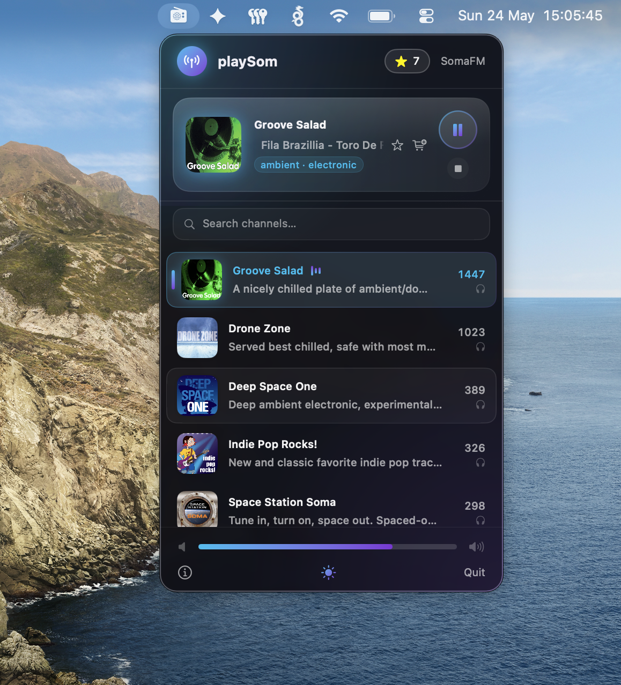

# 📻 playSom

A lightweight, open-source macOS menu bar app for streaming [SomaFM](https://somafm.com) internet radio.


---

> ❤️ **playSom is free — but SomaFM isn't.** They pay for servers, bandwidth, and music licensing entirely through listener support. Please consider [donating at somafm.com/support](https://somafm.com/support/).

---

## Features

- 🎵 **30+ SomaFM Channels** — Groove Salad, Drone Zone, DEF CON Radio and more
- 📡 **Lives in your menu bar** — No dock icon, no clutter
- ⭐ **Favorites** — Save tracks you love and find them instantly
- 📌 **Pin channels** — Keep your go-to stations at the top of the list
- 🛒 **Bandcamp search** — Buy music you discover with one click
- 🔍 **Search** — Filter channels by name, genre, or DJ
- 🎚️ **Volume control** — Built-in slider with persistent memory across launches
- 🎹 **Media key support** — Play/Pause with your keyboard
- 🖥️ **Now Playing** — Shows current track in the macOS media widget
- 💡 **Hover tooltip** — Hover over the menu bar icon to see the current song without opening the app
- 📊 **Live data** — Channel list refreshes automatically every 60 seconds
- 🌙 **Dark & Light mode** — Follows your preference
- ⚡ **Lightweight** — Native Swift, ~5 MB, ~1.7% CPU at idle

## Installation

### One-line install (Recommended)

```bash
curl -fsSL https://raw.githubusercontent.com/FlintBeastwood/playSom/main/install.sh | bash
```

This downloads the latest release, installs to `/Applications`, and removes the macOS quarantine flag automatically.

> **First launch:** Since playSom is not signed with an Apple Developer certificate, right-click `playSom.app` in Finder → **"Open"** → **"Open"** to bypass the Gatekeeper warning. You only need to do this once.

### Manual install

1. Go to [Releases](https://github.com/FlintBeastwood/playSom/releases)
2. Download `playSom-vX.X.X.zip`
3. Unzip and move `playSom.app` to your `/Applications` folder
4. Right-click → Open for the first launch

### Build from Source

Requires **Xcode 16+** and **macOS 13.0+**.

```bash
git clone https://github.com/FlintBeastwood/playSom.git
cd playSom
open playSom.xcodeproj
```

Press `⌘R` in Xcode to build and run.

## Screenshots



## Tech Stack

- **Swift + SwiftUI** — Native macOS UI
- **AVPlayer** — Audio streaming
- **MenuBarExtra** — Menu bar integration
- **MPNowPlayingInfoCenter** — Media key & Now Playing support

## How it works

1. Loads channel data from the [SomaFM API](https://somafm.com/channels.json)
2. Parses `.pls` playlist files to get direct stream URLs
3. Pre-resolves stream redirects with a browser User-Agent to prevent server-side blocks
4. Streams audio via `AVPlayer` (AAC/MP3)
5. Updates Now Playing info for macOS media controls

## Contributing

Contributions are welcome! By submitting a pull request, you agree to the [Contributor License Agreement](CLA.md).

1. Fork the repo
2. Create a feature branch: `git checkout -b my-feature`
3. Commit your changes: `git commit -m "Add my feature"`
4. Push and open a Pull Request

## License

GNU AGPLv3 License — see [LICENSE](LICENSE) for details.
Copyright © 2026 Tobias Lettenmeier

## Credits

- [SomaFM](https://somafm.com) — Listener-supported, commercial-free internet radio since 2000
- Please [support SomaFM](https://somafm.com/support/) to keep the music playing! 🎶
